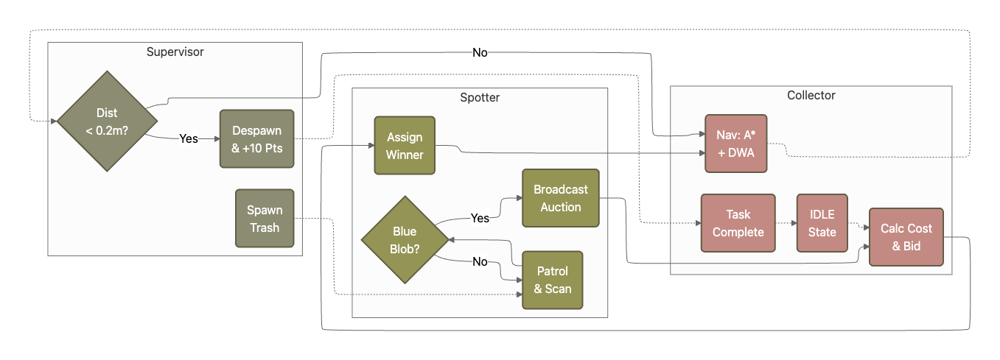
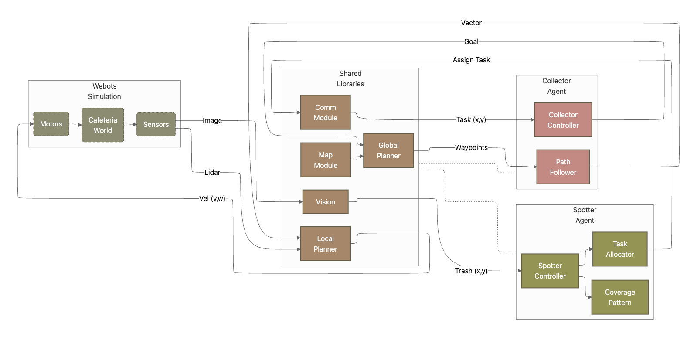

# Multi-Robot Coordination: Scaling vs. Specialisation

**A Webots simulation benchmarking the efficiency of independent swarms versus coordinated teams.**

  

## "Too Many Cooks" (or "Too Many Cleaners")
In theory, adding more robots should improve task performance. In practice, robots can waste effort through path overlap, item contention, and collisions. Coordination promises efficiency, but also introduces overhead. One study shows how cleaning success rises by only about 6.8% when moving from a single-robot baseline to a two-robot team (Patil, Banavar and Narayanan, 2023).

As the tipping point between benefit and overhead is context-dependent, we created a structured, sandboxed way to test it. This simple webots simulation provides a reproducible framework to compare **brute-force scaling** against **role specialisation** in a cafeteria cleaning task.

---

## The Experiment
We simulate a cafeteria environment with scattered rubbish (red/green objects) and static obstacles. We compare three distinct configurations under identical conditions:

| Setup | Architecture | Description |
| :--- | :--- | :--- |
| **Baseline** | Single Agent | One general-purpose robot scanning and cleaning alone. |
| **Swarm** | Independent | Three general-purpose robots working simultaneously but **without communication**. |
| **Coordinated** | **Spotter-Collector** | One static "Spotter" (high vantage) directing two mobile "Collectors" via comms. |

---

## System Architecture

### Overview


### Components


### Logic


### 1. The Controller Stack
Each robot operates on a layered architecture:
* **Perception Layer:** Handles camera input (rubbish detection) and LIDAR/Distance sensors (obstacle detection).
* **Decision Layer:**
    * *Independent Mode:* Random walk or heuristic search until a target is visually confirmed.
    * *Collector Mode:* Listens for coordinates from the `Spotter`, queues targets, and executes path planning.
* **Action Layer:** Translates target vectors into motor velocities (differential drive).

### 2. Communication Protocol (Setup 3)
The Coordinated setup utilises the Webots `Emitter` and `Receiver` nodes to simulate a local area network.
* **The Spotter:** Uses a ceiling-mounted camera to segment the arena. When rubbish is detected, it broadcasts a packet: `{ID, Coordinates(x,y), Priority}`.
* **The Collectors:** operate as "blind" workers. They do not scan for trash; they simply execute the navigation stack based on received coordinates, reducing redundant path overlap.

---

## Key Hypotheses
This framework allows us to validate the following theories:
1.  **Scaling Saturation:** Independent robots (Setup 2) will reduce total time compared to Baseline, but with significant efficiency loss due to path overlap.
2.  **Coordination Advantage:** The Spotter-Collector team (Setup 3) will achieve the fastest completion time by eliminating search redundancy.
3.  **Efficiency Delta:** Coordinated robots will travel less total distance per item collected than independent swarms.

## Getting Started

1.  **Clone the repo**
    ```bash
    git clone [https://github.com/ZahinMai/Clean-Up-Crew.git](https://github.com/ZahinMai/Clean-Up-Crew.git)
    ```
2.  **Launch Webots**
    Open `worlds/cafeteria_cleaning.wbt`.
3.  **Select Controller**
    Edit the robot `controller` field to switch between `independent_controller.py` and `coordinated_controller.py`.

---

## Contribution
This repository serves as a prrof-of-concept **benchmarking tool** for multi-robot studies. It allows us to:
* Visually prove the efficiency of specialised roles.
* Quantify the "coordination overhead" (latency/complexity) vs. the "interference cost" (collisions/overlap).
* Test custom path-planning algorithms within a pre-built coordination framework.
